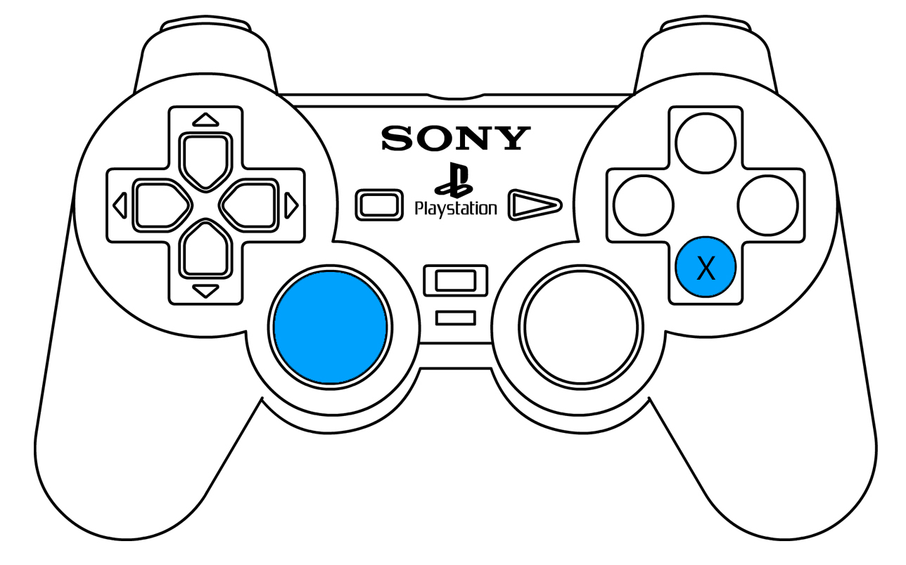

# Overcooked
* Lucas Alonso Ortega
* Juan José Pérez López
* Daniel Domínguez Gutiérrez
# Juego
Nos hemos propuesto implementar una versión simplifiada del juego [Overcooked](https://store.steampowered.com/app/448510/Overcooked/?l=spanish).

El juego Overcooked es una simulación de cocina con vista isométrica en el que el usuario va recibiendo pedidos de comida que debe ir completando usando ingredientes y herramientas en un tiepo limitado. Hemos mantenido el mismo concepto solo que la cámara en nuestra aplicación estará en la cara del personaje para que esta sea coherente en realidad virtual.

# Uso
Para el uso de la aplicación son necesarias unas **gafas RV** básicas, un **mando de PlayStation 4** que deberá ir conectado al móvil por bluetooth y evidentemente la apk de la aplicación en el smartphone en el que se vaya a usar.
## Controles

* El **joystick izquierdo** nos permitirá despazar al personaje hacia delante y hacia atrás y también girar la cámara.
* El **botón X** nos permite agarrar y soltar objetos.

## Cómo jugar

**(Aquí GIF de ejecución + como jugar redactado)**
# Hitos de programación

* Hemos implementado un script **Selectable** que escucha los eventos de puntero (que equivalen a la dirección de la mirada en RV) usando las clases de Unity IPointerEnterHandler y IPointerExitHandler para que el usuario pueda seleccionar los objetos que incluyan a dicho script como componente.

* Además tambiéns hemo implementado dos scripts que heredan de Selectable para definir el comportamiento los objetos que se pueden agarrar (**Catchable**) y los que pueden contener otros objetos (**Container**). Una de las mayores dificultades de esta implementación fueron los **platos** porque estos se deben comportar tanto como un objeto que se pueda agarrar como un contenedor.

* En el script **GameController** almacenamos todos las objetos estáticoss del juego que necesitan los demás scripts (ej: el objeto jugador, el material usado para renderizar el objeto seleccionado...).

El GameController también escucha algunos **eventos comunes** para varios objetos como pulsar el botón X, ya que de otro modo todos los objetos seleccionables (que son los que tienen el script Selectable) tendrían que escuchar por este en el Update, lo cual sería ineficiente.

Además también controla el **temporizador del juego** y las **condiciones de victoria**.

# Aspectos destacables
* **El usuario puede desplazar el giro de la cámara usando el giroscopio del móvil junto a las gafas RV o mediante los joystick del mando**. Lo hemos decidido así porque la acción principal del juego no siempre ocurre en el mismo lugar y es incómodo mantener giros amplios durante demasiado tiempo.

* El usuario interactúa con los diferentes elementos de la escena seleccionándolos con la mirada. **El objeto que está seleccionado actualmente es renderizado con una textura resaltante** (amarilla) para que el usuario tenga claro que objeto está seleccionando en cada momento.

* Hemos implementado algunos sonidos sencillos para indicar al usuario cuando hace algo mal o bien. Por ejemplo: si una encimera ya está ocupada y el usuario intenta colocar algo en ella, se reproducirá **sonido de error**.

* También estamos usando el **micrófono** para escuchar por la palabra "help". Al hacerlo se mostrará unas instrucciones de la aplicación.

# Trabajo en equipo
**(Aquí la lista de tareas etc...)**
